## Calm Terminology, Actions, and Dependencies

Nutanix Calm is a multi-cloud application lifecycle manager, which means it allows you to model your applications in easy-to-consume blueprints, deploy those apps across a variety of on-prem and public clouds, and manage them throughout their entire lifecycle.  Combine this functionality with a self service focused Marketplace, robust policy and governance, and showback, and Calm enables IT and Developers to quickly turn complex operations into a simple, one-click request.

While in-depth knowledge of application blueprints is not required for the majority of Calm users, it is necessary for IT Operators and Developers who are looking to build custom blueprints from the ground up.  This blog is aimed at those users who are looking to learn more about the objects within a Calm blueprint, and how they interact with one another.

We’ll first walk through importing an example blueprint into your own Calm environment, which is an optional step.  Next, we’ll cover some basic Calm terminology, followed by best practices on choosing where to add Calm operations into the various blueprint actions.  Finally, we’ll wrap things up by showing the various strategies for introducing dependencies between services.


## Getting Started

To keep this blog as short as possible, we’ll be working through an example blueprint stored in [GitHub](https://github.com/MichaelHaigh/calm-blueprints/tree/master/DependencyTaskExample).  If you’re the type of person that learns best via hands on work, then use a tool like **wget** or your favorite browser to download the following file:


```
https://raw.githubusercontent.com/MichaelHaigh/calm-blueprints/master/DependencyTaskExample/Dependency-Task-Blog-Initial.json
```


Alternatively, you’re welcome to skip ahead to the next section and follow along via the pictures and descriptions.

Open up a browser page to Prism Central, and navigate to the **Calm** service.  Along the left side, open up the **blueprints** page, and then click the **Upload Blueprint** button.  In the window that appears, select the blueprint JSON that was just downloaded.  Name the blueprint as you’d like, and select the project of your choice (preferably one with multiple providers added).


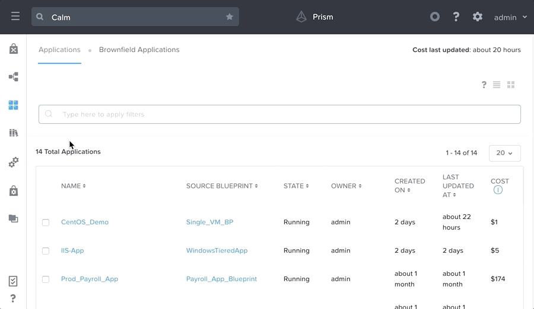


_Blueprint Upload_

Once uploaded, the first step is to click the **Credentials** button along the top, and then paste in an **SSH Private Key** in the CENTOS credential.  Next, click **Back**, and then click **Save**.  If the blueprint is able to save without errors, then move on to the next section.

If you receive errors upon save, that likely means you do not have either AHV or AWS configured for this particular project.  You can either switch the missing provider to a provider that you do have associated to this project, or just ignore the errors.  If you ignore the errors, you will not be able to launch the blueprint, but since this is just a demonstration blueprint, there’s no problem with that.


## Calm Terminology Basics

In order to have a solid grasp on task ordering and execution, we’ll need to ensure that we understand the main components of a Calm blueprint.  We’ll go through a couple of screenshots of our blueprint, where the green numbers will correlate to the numbered lists below.


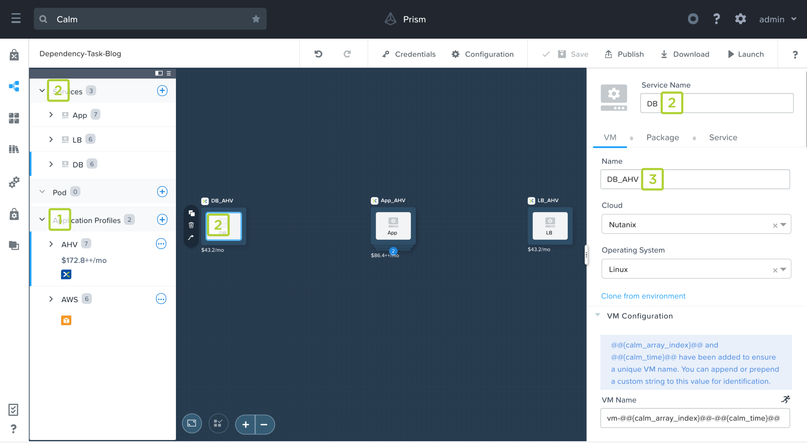


_Calm Blueprint Canvas_


1. **Application Profiles** expose simple choices to your end users.  Often these choices are on where an application should run (AHV or AWS), but they can also be used for “t-shirt” sizing (Small or Large), or a combination of the two (Small AHV or Large AHV or Small AWS).  You, as an IT operator or developer, should have a good grasp on the underlying differences of these choices, while abstracting that complexity from your end users.  Note the blue line to the left of the “AHV” application profile in the image above, this designates which app profile we’re currently working on.
2. **Services** are _logical_ entities exposed by an IP, which span all application profiles, and are managed by Calm.  End users and services communicate amongst each other over a network via their exposed IPs and ports.
3. **Substrates** are a combination of the underlying cloud and the virtual machine instance.  When the desired cloud is selected in the Calm UI, all of the fields required for creating a virtual machine instance on that particular cloud are displayed — the combination of all these fields make up a substrate.  Substrates do _not_ span application profiles, so it’s considered a best practice to name substrates as a combination of the service name and app profile name (DB_AHV or DB_AWS or DB_Small or DB_Large).


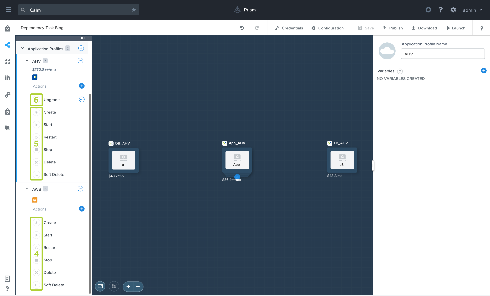


_Calm Application Profiles and Actions_


4. **Application Profile Actions** (or **Profile Actions** for short) are a set of operations that you can run on your application.  For example, when launching a blueprint, the “Create” action is run.  If your application is not needed for a period of time, you could then run the “Stop” action to gracefully stop your application.  When you’re ready to resume work, running the “Start” action will bring the app back up.  There are two different types of profile actions, as follows.
5. **System Defined Profile Actions** are automatically created by Calm in every blueprint and underlying application.  Since these are created for you, you cannot _directly_ edit the tasks or the order of tasks within the canvas.  However there are ways to control the order of operations, which we’ll cover during the final section of this blog, **Calm Dependencies**.
6. **Custom Profile Actions** are created by the blueprint developer, and should be added whenever you need to expose a set of operations to the end user.  Common custom profile actions are “Upgrade”, “Scale In”, and “Scale Out”.  Since the actions are custom, individual tasks can be manually added in any order desired by the developer.  Again, more on this during the final section of this blog.


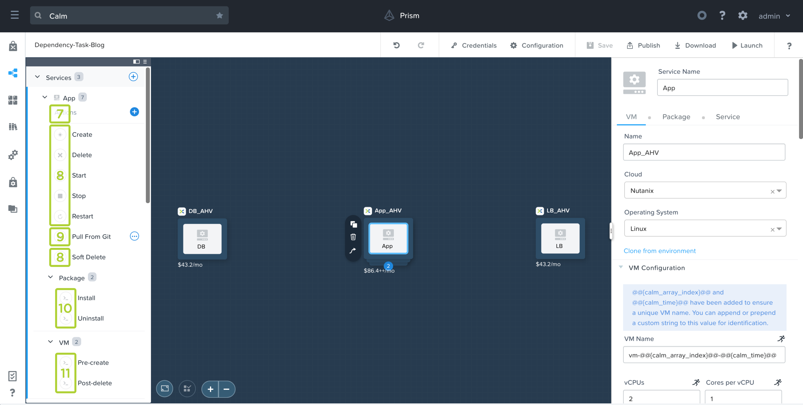


_Calm Service Actions_


7. **Service Actions** are a set of operations to be run on an individual service.  At the time of this blog’s publishing, they can not be invoked directly by the app’s end user, however they’re invoked indirectly via either profile actions or package (un)install (10) operations.  As mentioned in point number 2, services span application profiles, so their actions (and the underlying operations under those actions) do as well.  If you create a service action in the “AHV” profile, the same service action will be available in the “AWS” profile.  There are two different types of service actions, as follows.
8. **System Defined Service Actions** are automatically created by Calm in every blueprint and underlying application.  While these actions cannot be individually invoked, they are called when the corresponding profile action is run.  For instance, any operations placed under the “Stop” service action when be run when an end user invokes the “Stop” profile action.
9. **Custom Service Actions** are created by the blueprint developer, and should be added for any repeatable operations within the blueprint, like a “function” definition in a programming language.  For instance, say during both the “Create” and “Upgrade” profile actions, the “App” service should pull new code from git.  Rather than maintaining two separate tasks that perform the same set of operations, you could create a single custom service action which is then referenced in both the “Create” and “Upgrade” actions.
10. **Package Install / Uninstall** are operations which are run during the “Create” or “Delete” profile actions.  In other words, they’re operations run when a user first launches a blueprint, or finally deletes the entire application.  More on the logic behind this in the next section, **Actions and Tasks Best Practices**.  Package Install and Uninstall are unique to each application profile, which means your tasks or the task contents can vary depending upon the underlying cloud or the app’s “t-shirt” size.
11. **VM Pre-create / Post-delete** are operations which are run _before_ the substrate is created, or _after_ it is deleted.  A common use case for this is to make an API call into an IP Address Management (IPAM) system to get an IP for a to-be-created VM.  Since other operations described so far are run after the substrate has already been created, VM pre-create is necessary if a property of your substrate relies on a 3rd party system.


## Actions and Tasks Best Practices 

When customers and partners are developing their first Calm blueprint, they commonly ask “Where should I place this script?  Under VM pre-create, package install, or create?”  My typical answer is “it depends,” and while this is accurate without additional knowledge about their application, it’s not very useful.  So now that we have a baseline of Calm terminology defined, let’s dive into the best practices of where to place various operations within your blueprint.  By the end of this section, you should be able to answer the previous question yourself!

There are two critical factors in answering this question, the first of which is the order that Calm executes these actions.  The easiest way to remember this is to select the “Create” **System Defined** **Profile Action** under any of the app profiles.  Let’s go through these individually in order of operation.  Note: orange arrows in Calm represent the order of execution.


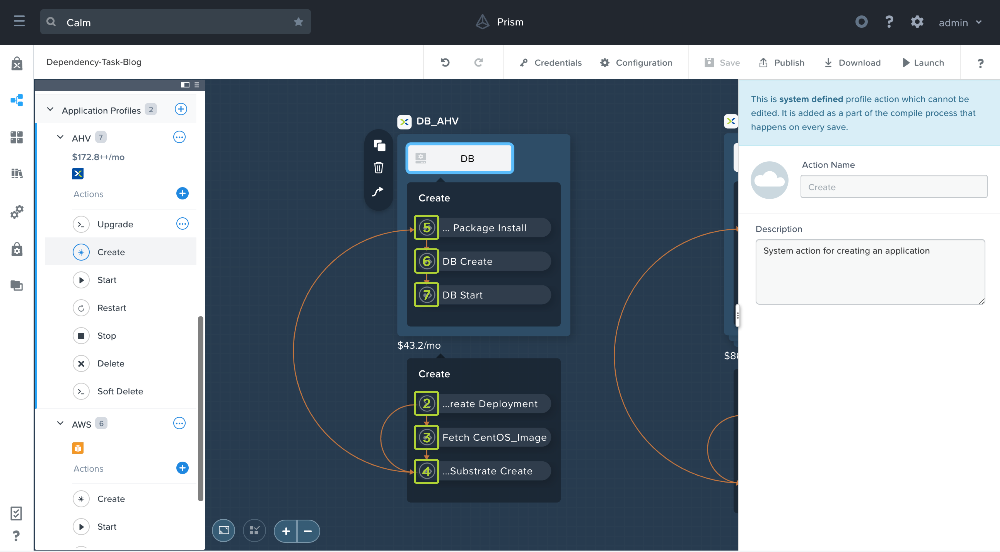


_Calm Create Action_


1. **VM Pre-create (not pictured)** - as mentioned in the previous section, VM pre-create happens _before_ the substrate is created.  Therefore it is not represented on the UI, however tasks put under this section are run _before_ any of the actions shown in the image above.
2. **Create Deployment** - a deployment is an internal Calm construct, and outside the scope of this blog.
3. **Fetch CentOS_Image** - when the “Downloadable Image Configuration” option is used (under the “Configuration” section of a blueprint), this is the next action run.  If there isn’t an image with a matching “Source URI” on Prism Central, then Calm will create a new image.  If the downloadable image configuration option is not used, then this action will not be shown in the UI.
4. **Substrate Create** - this operation creates the substrate, which means Calm will perform an API call into the corresponding cloud to create a new virtual machine instance.
5. **Package Install** - this is the first action that developers can manually place tasks within.  This section is commonly used for installing software packages, for example we could install PostgreSQL with **sudo** **yum -y install postgresql-server postgresql-contrib**.  Package install and its underlying tasks are only run a single time, when a user launches a blueprint (“create” profile action).
6. **Create** - this is the next action that developers can manually place tasks within.  This section is commonly used for configuring the service components, for example we could setup PostgreSQL with **sudo postgresql-setup initdb**.  Like package install, the create action and its underlying tasks are run only a single time.
7. **Start** - this is the final action that developers can manually place tasks within.  This section is commonly used for starting the service components, for example we could start PostgreSQL with **sudo systemctl start postgresql**.  Not only is this action and its underlying tasks run when a user launches a blueprint (“create” profile action), but also any time the user runs the “start” profile action (to bring the app back up after previously running “stop”).

As mentioned, understanding the order that Calm initiates the various actions is one of the critical factors.  Without this knowledge, you could accidentally place a setup script before an installation script, which would cause your application deployment to fail.

The second critical factor in determining where to place your various tasks is dependent upon your **application profiles**.  If you recall from the previous section, services (and therefore their service actions) span application profiles, while package installs do not.  So if you have any operations that are dependent upon the underlying cloud, or the “t-shirt” size of your application, it’s best to place these operations under the package install section.

In our example blueprint, under the DB service, we have an “Install_DB_Software” package install task in both the AHV and AWS app profiles.  However, if you view the example script within those tasks, you’ll see they’re different:


_AHV App Profile - DB Package Install Task_


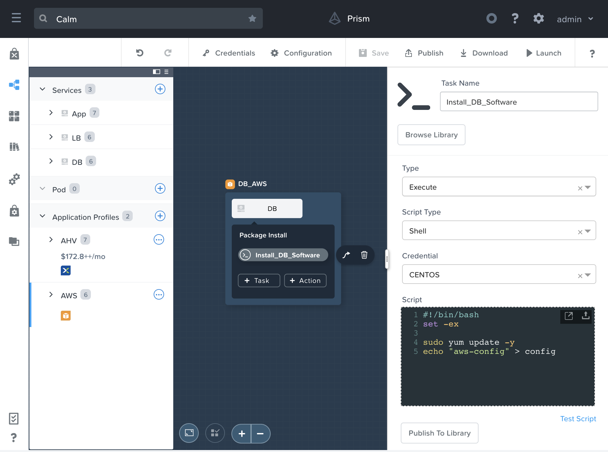


_AWS App Profile - DB Package Install Task_

Note the very last line in those two scripts have a different “echo” statement.  Differences in package installs can go beyond script contents, you can add any number of new tasks or service actions within one app profile, and those operations will not be added to the second app profile.

Compare this to service actions, which span application profiles.  In our example blueprint, we currently do not have any tasks within the DB’s “create” service action, which can be verified by selecting our **AHV** app profile, then the **DB** service, and finally the **Create** action.  Let’s change that and create a task by clicking the **+ Task** button within the DB service tile on the blueprint canvas, and then in the right pane, name the task, select **Execute**, then **Shell**, then **CENTOS**, and finally paste in the following script:


```
#!/bin/bash
set -ex

cat << EOF > configure_db
 "Created in AHV app profile,
  since service actions span
  app profiles, this will also
  appear in AWS app profile."
EOF
```


If you’re following along, your Calm blueprint should now look like this:


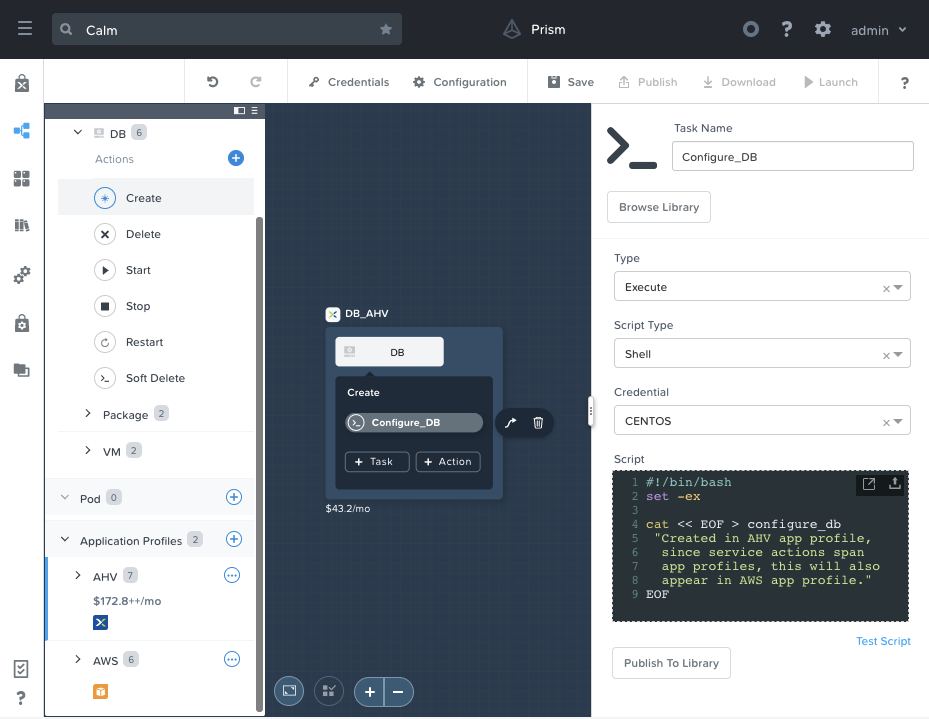


_AHV App Profile - DB Create Task_

Once you create the above task, switch over to the **AWS** profile, expand the **DB** service, select the **Create** service action, and click the **Configure_DB** task:


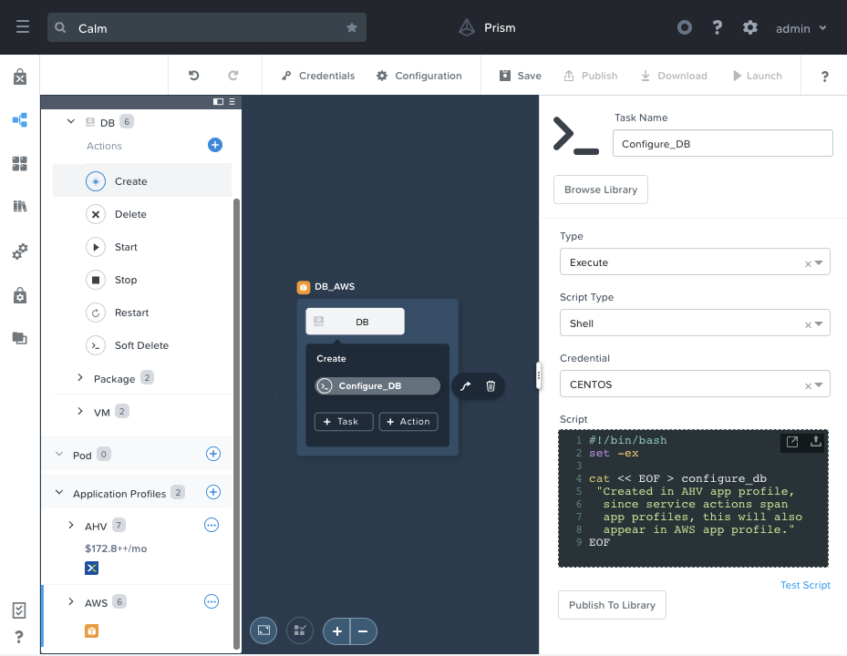


_AWS App Profile - DB Create Task_

As expected, our newly created task within our create service action is also present within our AWS application profile.  To summarize our findings from this section:


*   **VM Pre-create** operations run before the substrate is even created, in the even substrate properties are reliant on a 3rd party system.
*   **Package Install** operations are run first, and only once when the blueprint is launched.  The tasks and their contents can vary between the various application profiles.
*   **Create** operations are run next, and also only once when the blueprint is launched.  All tasks and their contents are the exact same across the various application profiles.
*   **Start** operations are the last to run when a blueprint is launched, and these same operations are run any time a user invokes the “start” profile action.  All tasks and their contents are the exact same across the various application profiles.


## Calm Dependencies


#### System Defined Profile Actions

In the Calm Terminology Basics section, we talked about the two types of profile actions, system defined profile actions and custom profile actions, and the ability to order the underlying operations.  Since Calm automatically does the majority of the “heavy lifting” for system defined profile actions (like making an API to create a VM, or perform a guest shutdown), there’s no way to _directly_ draw the orange arrows that represent the order of orchestration.  However, there are two methods to _indirectly_ draw the orange arrows, which will be the majority of this section.


*   Reference a macro which contains a property of “Service A” in a task of “Service B”
*   Draw a white dependency arrow from “Service B” to “Service A”


##### Macro References

Before we modify our scripts to contain macro references, let’s take a look at our current state.  In our example blueprint, under either of the application profiles, select the **Create** action, and view the lack of any orange arrows between the services.


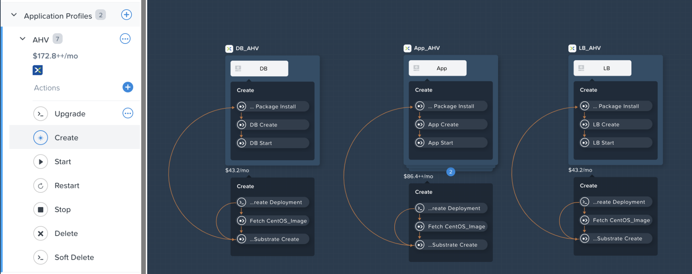


_Create Profile Action - Before Dependencies_

In a real three tier web app, the app tier will need to have knowledge of the database’s IP address (among other properties) in order to send information to be stored in the DB.  Similarly, the load balancer will need to know the web servers’ IP addresses in order to route the end user’s requests appropriately.  Let’s modify some package install scripts which will store these IPs in a configuration file on the app and load balancer services.

In the left configuration pane, select the **AHV** app profile, expand the **App** service, expand the **Package** section, click the **Install** action, and then in the blueprint canvas click the **Install_App_Software** task within the App tile.  In the right pane that appears, append the following lines to the existing script:


```
echo "DB_IP=@@{DB.address}@@" \
  > db_config
```


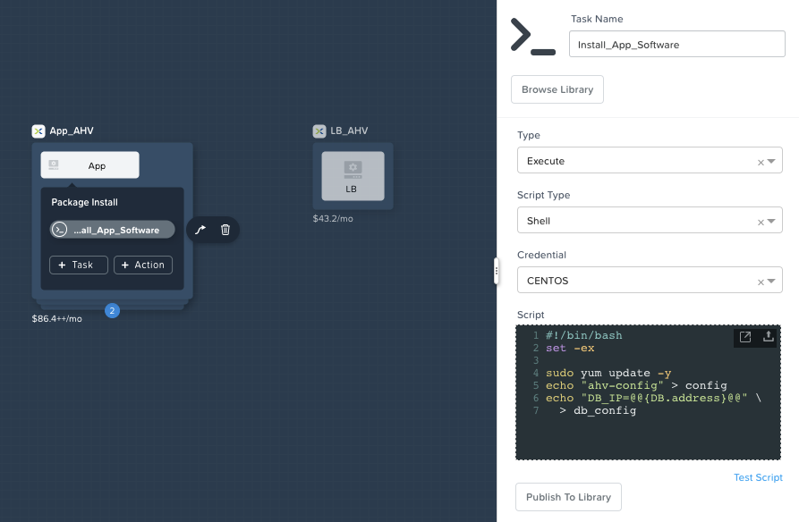


_App Package Install - Configure_App_

The **@@{DB.address}@@** macro will be patched with the actual DB’s IP address during the application deployment.  Let’s now expand the **LB** service in the left configuration pane, and follow the same steps to append the following lines to the load balancer’s package install task:


```
echo "APP_IP=@@{App.address}@@" \
  > app_config
```


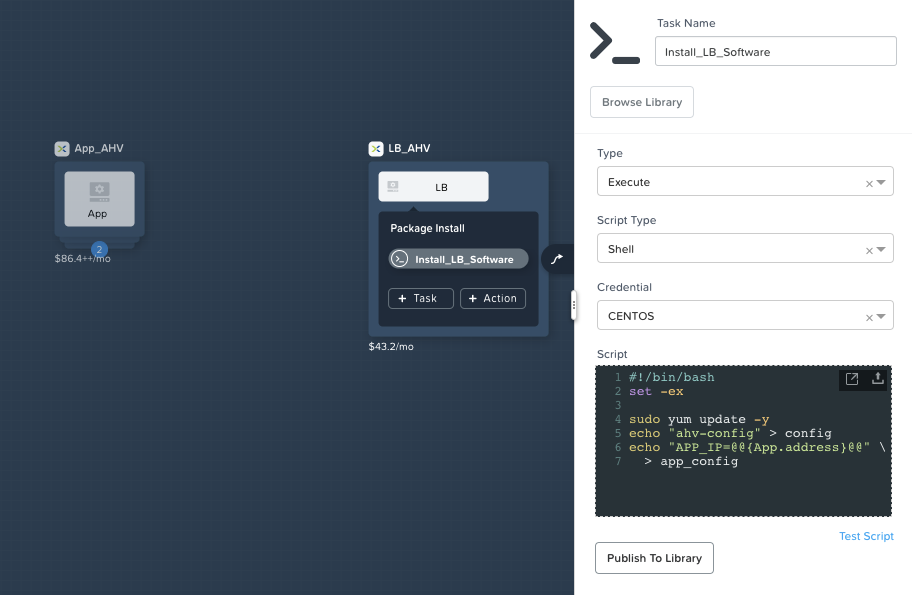


_LB Create Service Action - Configure_LB_

Now that we have our scripts create, go ahead and click the **Save** button at the top of the Calm UI.  After the blueprint have been saved, select the **Create** profile action under any of the **AHV** app profile.  If everything was done correctly, your blueprint canvas should look like this.


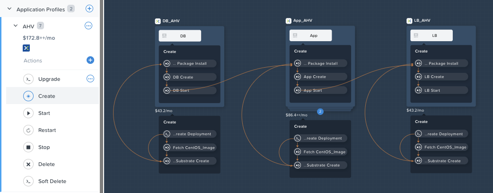


_Create Profile Action - After Macro References_

Note the presence of two new orange arrows, one going from the “DB Start” task to the “App - Package Install” task, and the second going from the “App Start” task to the “LB - Package Install” task.  Since a task within the App package install references a property of the DB service, Calm knows that it cannot execute App’s package install tasks until _after_ the DB service is fully up and running.  Each time you save a blueprint, Calm will parse the underlying scripts for any macro references, and automatically draw these orange arrows.


##### White Dependency Arrows

While our create action has proper dependencies introduced due to the macro references, what about our stop action?  If we expand either of our app profiles, and select **Stop**, we’ll see that our services do not contain any orange arrows between them.


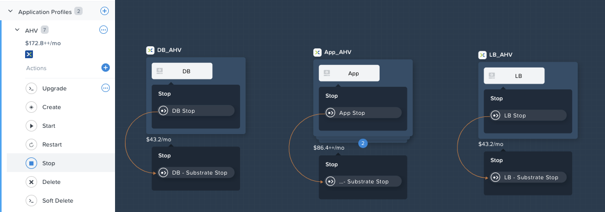


_Stop Profile Action - Before White Dependency Arrows_

While this may seem ok at first glance, this could cause a poor experience for our end users.  If the database service received instructions to shut down barely before the app or load balancer services, you could get into a situation where the web service accepts a request that later errors out due to the downed database.  This means we need some way to have the database go down very last, and when the app is starting back up, we need it to come up first.

To rectify this situation, click the **LB** service tile, in the small menu that appears to the left of the tile, click the white arrow icon with the **Create Dependency** tooltip, and then click the **App** service tile.  This will create a thick white line pointing from the LB service to the App service, and signifies that the load balancer service is _dependent upon_ the app service.  Repeat this same process to create another thick white line pointing from the App service to the DB service.  Click **Save** to allow Calm to pick up these changes and draw the orange orchestration arrows.


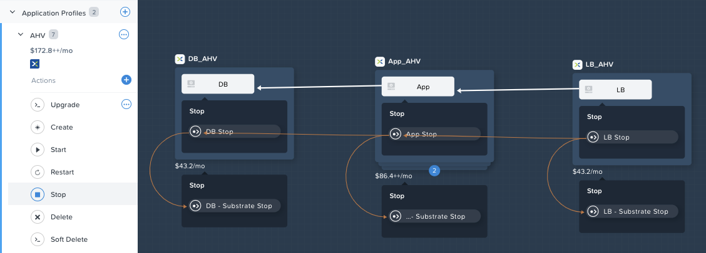


_Stop Profile Action - After White Dependency Arrows_

As a reminder, the orange arrows represent the direct order of orchestration, while the white arrows represent a logical view of dependencies.  We see the “LB Stop” task is run first, followed by the “App Stop”, and finally the “DB Stop”.  Now take a look at the **Start** profile action.


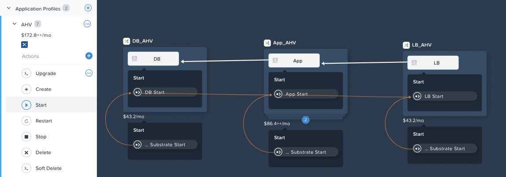


_Start Profile Action - After White Dependency Arrows_

Note that the orange arrows are pointing in the opposite direction.  While this may seem strange at first, it does line up with our goal of having the database start up first, and come down last, to prevent the situation we described earlier.

Before we move on to the next section, it’s worth talking about a common mistake novice blueprint developers make when combining macro references and white dependency arrows.  If we were to delete those white dependency arrows we just created, and draw them in the opposite direction (DB to App, App to LB), can you guess what might happen?


_Create Profile Action: Circular Tasks_

With the white arrows drawn in this direction, we’re telling Calm that the database service is dependent upon the app service, but the macro reference we created earlier is telling Calm the opposite.  This results in a circular dependency of the underlying operations, which are impossible to carry out.  Calm correctly picks up on this error, and prevents a user from launching a blueprint in this state.


#### Custom Profile Actions

Now that we’ve covered system defined profile actions, let’s dive into custom profile actions, which are quite straightforward.  In the example blueprint, under the **AHV** application profile, select the **Upgrade** custom action.


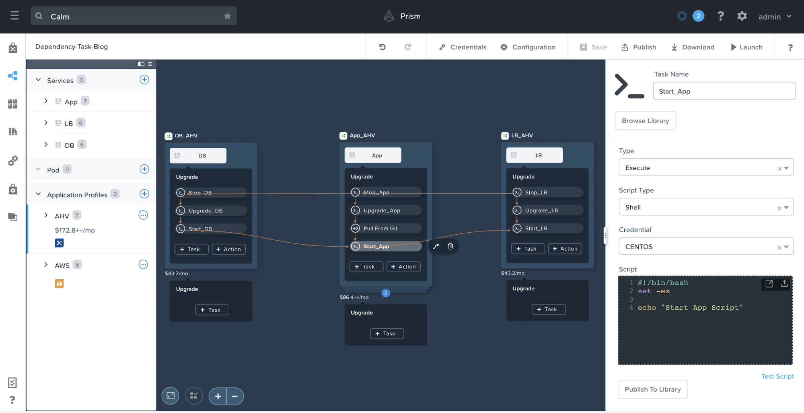


_Custom Profile Action_

As you can see, Calm provides the ability to directly draw the orange arrows by selecting a task (“Start_App” for example), clicking the small arrow icon, and then selecting the next task (“Start_LB” for example).  This instructs Calm that the “Start_LB” task can only begin executing after the “Start_App” task has successfully completed.  You’re able to draw these orange orchestration arrows in any manner you desire, as long as you do not introduce a circular flow.

## Endpoints

Endpoints are the target resources where the defined tasks in a runbook or blueprint are executed. The endpoints are communicated by
using IP addresses, host names, port tuple, and different protocol attributes.

An endpoint is either one of the following type.

* **Windows machine**
* **Linux machine**
* **HTTP service endpoint**

## Runbooks

Runbook is a framework to automate routine tasks which pan across multiple applications or not tied to any application. A runbook is a collection of tasks that you can define to run sequentially or parallelly at different [endpoints](#endpoints).

You can define the following types of tasks in a runbook -

* **Execute**: Use this task to run shell/powershell and escript(custom python) scripts.
* **Set Variable**: Use this task to run a script and create variables.
* **Delay**: Use this task to set a delay interval between two tasks or actions.
* **HTTP**: Use this task type to do REST calls to an HTTP endpoint.
* **While Loop**: Use this task type to iterate multiple tasks in a loop till it meets the defined condition.
* **Decision Task**: Use this task type to define different flows/paths based on the exit condition.

- [Calm Runbooks and API Automation Blog](https://www.nutanix.dev/2020/06/12/nutanix-calm-runbooks-api-automation/)

## Summary

In this blog post we covered a variety of topics aimed at IT Operators and Developers looking to learn more in depth topics about Calm blueprints to better aid in blueprint development.  We started things off by importing an example blueprint into your local PC, and then defining some basic Calm terminology.  We then went over the differences in the various actions, and best practices around placing tasks properly.  Finally, we wrapped the blog up by going over the different ways to introduce dependencies between services.

_©️ 2019 Nutanix, Inc. All rights reserved. Nutanix, the Nutanix logo and the other Nutanix products and features mentioned herein are registered trademarks or trademarks of Nutanix, Inc. in the United States and other countries. All other brand names mentioned herein are for identification purposes only and may be the trademarks of their respective holder(s)._

