## Setup

To start the DSL lab we have provided a [DevWorkStation.json](https://raw.githubusercontent.com/bmp-ntnx/QuickStartCalmDSL/master/DevWorkstation.json) blueprint to quickly get you started. The included DevWorkstation.json builds a CentOS VM with all the necessary tools.  This blueprint can be launched directly from Calm, but we recommend publishing it to the Calm Marketpkace for Self Service.  Also, included is [software-developer.png](https://github.com/bmp-ntnx/QuickStartCalmDSL/blob/master/software-developer.png) which can be used as an icon

## Launch DevWorkstation from Calm Marketplace


-   **Important: Select the Credentials tab and enter desired User/Pass**

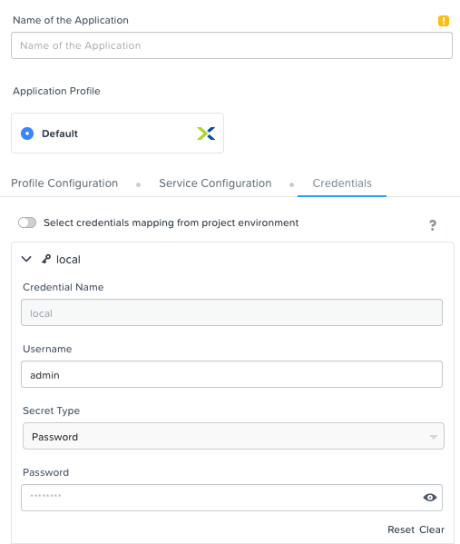

-   Enter the name of Application "DevWorkstation-\<INITIALS\> and fill out the form with the requested information

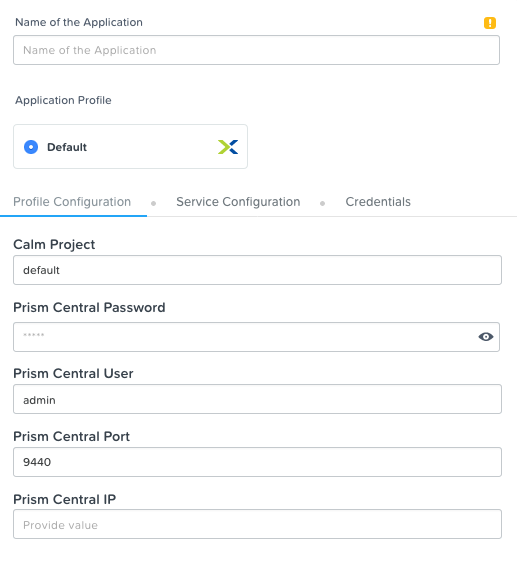

-   Press Create

-   While waiting review the audit log to see packages being deployed.  The blueprint automatically installs several utilities along with Calm DSL

## Once the application is "running" SSH to the DevWorkstation

-   The IP address of the DevWorkstation is listed under the application overview.  The SSH user/pass is what was set under the credentials tab


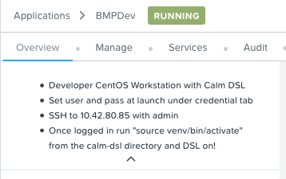

## Start the virtual environment and connect to Prism Central

-   cd to the "calm-dsl" directory from home

-   Run ```source venv/bin/activate``` to switch to the virtual environment. This will enable the virtual environment for Calm DSL

-   **Optional:** This has already been done through the blueprint launch. Once you SSH into the DevWorkstation we can setup the connection to Prism Central by running ```calm init dsl```

-   Verify the current config settings by running ```calm show config``` 


## List the current blueprints in Calm

-   Run ```calm get bps``` and we see all the blueprints in Calm with their UUID, description, application count, project, and state


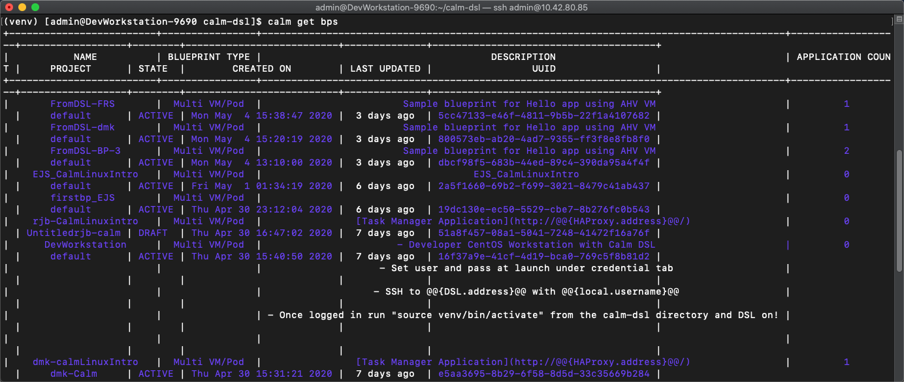

-   Run ```calm get bps -q``` to display quiet output with only the BP names


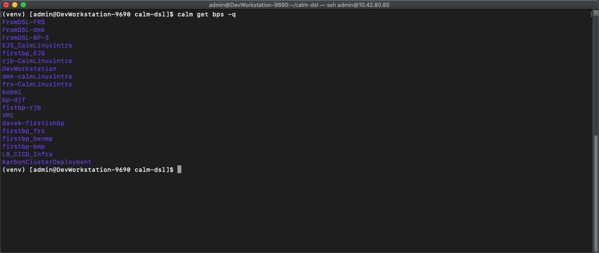

## Review python based blueprint and make a modification

-   Change to the "HelloBlueprint" directory and run ```ls```

    -   This directory and it's contents were automatically created during the blueprint launch.  As part of the DevWorkstation blueprint launch we ran ```calm init bp``` which creates a sample blueprint configured to the connected Calm instance

-   There is a file called "blueprint.py" which is a python version of a blueprint

-   There is a "scripts" directory. This is where the bash/powershell/python scripts are stored that are referenced within the blueprint


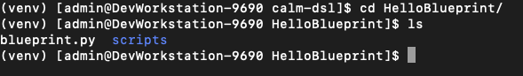

-   Run ```vi blueprint.py```

-   Review the blueprint for familiar constructs.  To skip directly to a line enter ```:<linenumber>```

    -   Credentials (line 54-60)

    -   OS Image (line 62-66)

    -   Under class HelloPackage(Package) you will see references to the pkg\_install\_task.sh script in the scripts directory (line 139)

    -   Basic VM spec information (vCPU/memory/disks/nics) (line 153-159)

    -   Guest Customization contains cloud-init (line 161-171)

-   In the blueprint.py modify the number of vCPU

    -   Change the vCPU from 2 to 4 (line 154)


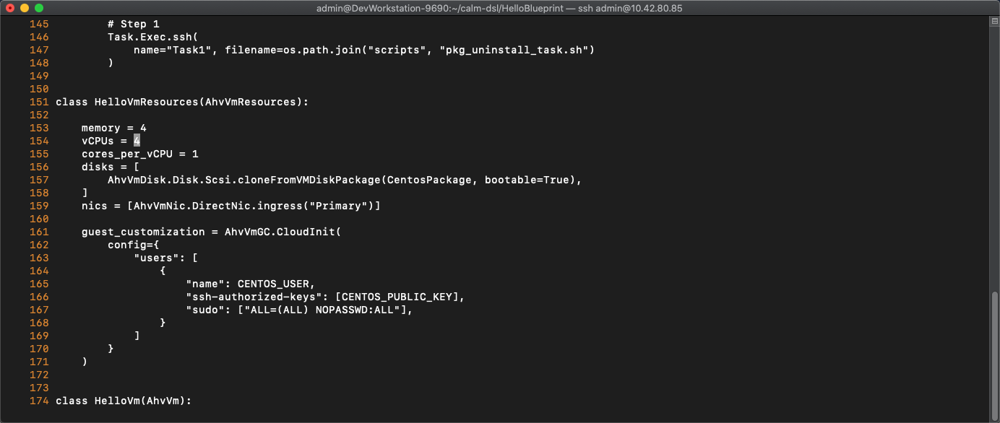

-   Add a unique VM name using a macro (line 185)

    -   ```provider_spec.name = "<Initials>-@@{calm_unique}@@"```


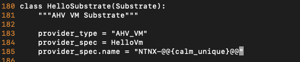

-   Write/quit ```:wq``` the .py blueprint file to save and close

## Modify pkg\_install\_task.sh

-   Change to the scripts directory and run ```ls```. We will see 2 scripts that are being referenced inside blueprint.py

-   Run ```cat pkg_install_task.sh``` to view the current contents of the install script.  What does the script do?


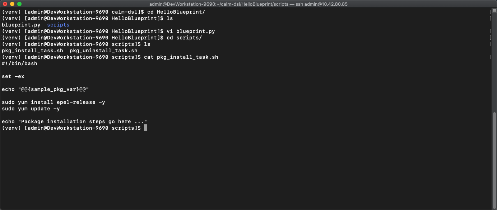

-   Run ```curl -Sks https://raw.githubusercontent.com/bmp-ntnx/prep/master/nginx > pkg_install_task.sh``` to replace the existing install script

-   Run ```cat pkg_install_task.sh``` to view the changed script.  What does the script do now?


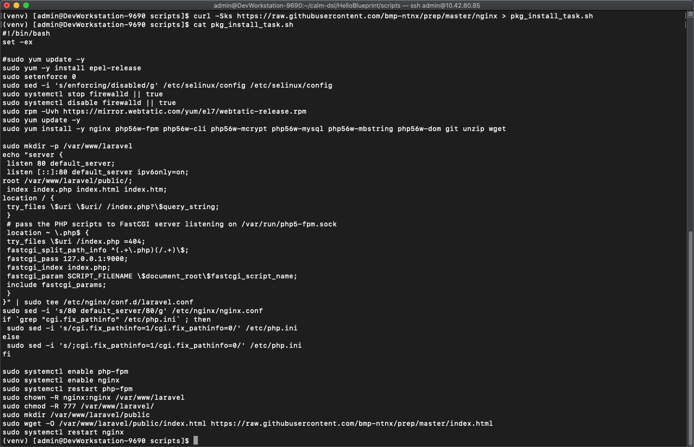

## Push the modified blueprint.py to Calm

-   Return to the "HelloBlueprint" directory

-   Run ```calm create bp --file blueprint.py --name FromDSL-<Initials>```

    -   This converts the .py file to json and pushes it to Calm


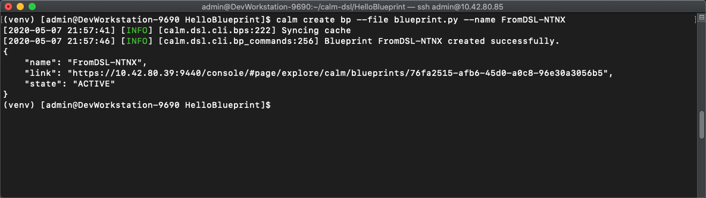

-   **Optional:** Run ```calm compile bp -f blueprint.py``` to view the python blueprint in json format from DSL

-   Verify your new blueprint by running ```calm get bps -q | grep FromDSL-<Initials>```


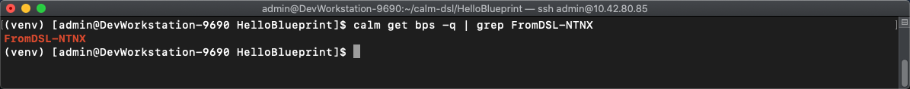

## Launch the blueprint into an application

-   Run ```calm get apps``` to verify all the current applications before launching your new app

    -   We can also run ```calm get apps -q``` to quiet the details like we did with blueprints earlier

-   Launch your newly uploaded blueprint into an application

-   Run ```calm launch bp FromDSL-<Initials> --app_name AppFromDSL-<Initials> -i```


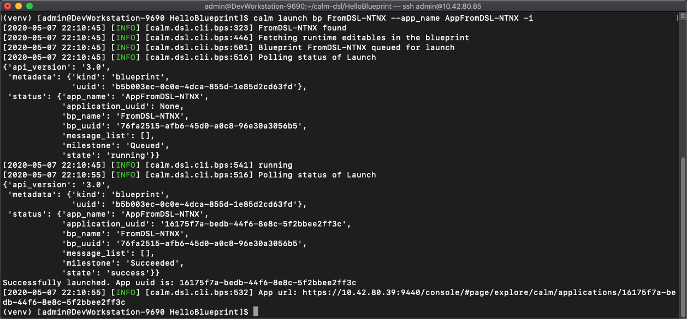

-   Run ```calm describe app AppFromDSL-<Initials>``` to see the application summary

-   Once the app status changes to "running" we will have a nginx server deployed from Calm DSL!


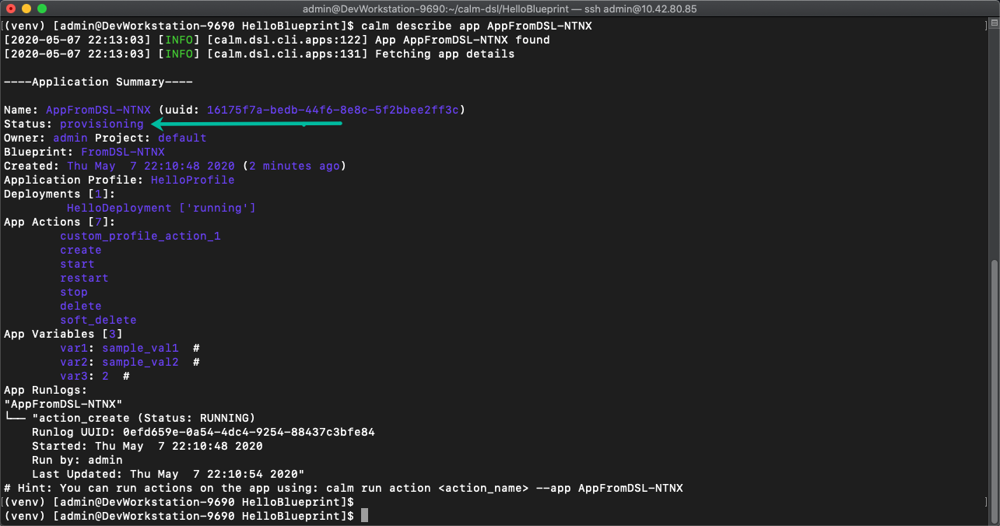
<!--- -   Run ```calm describe app AppFromDSL-<Initials> --out json | grep -F '[{\"ip\":\"'``` to search the json output for the VM IP --->

-   Now we need to get the VM/Application IP address.  To get this we will pull the "address" from the application json output using jq by running the following:

-   ```calm describe app AppFromDSL-<Initials> --out json | jq '.status.resources.deployment_list[].substrate_configuration.element_list[].address'```


<!--- 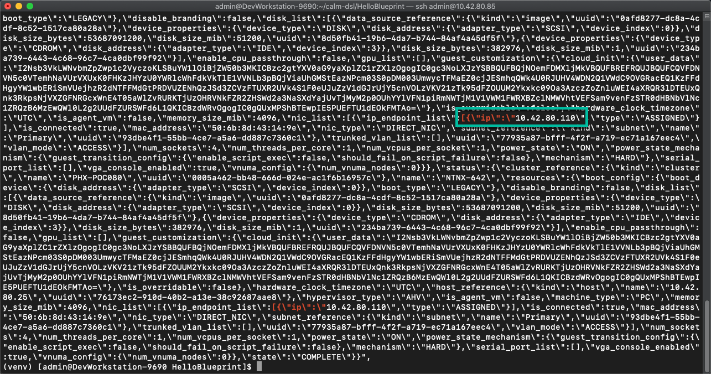 --->


-   Enter the IP in a web browser and this will take you to the nginx **"Welcome to DSL"** web page


## Log into Prism Central to verify

-   Check the blueprint created from DSL

-   Check the application launched from DSL

## Looking back

As we went through this module not only we you use Calm DSL, but we also used several native Linux tools such as vi, curl, grep, cat, pipe, and redirects.  Calm DSL allows extended felxibily by combining it with these powerful tools.  Think about how we can add git to this workflow to track changes or modify blueprints with sed

## Optional: Getting started with git

Speaking of git lets contiue on and push our blueprint to git.  We will need a github.com account before you can get started

-   Logon to git and create new repo "dsl-blueprints"

-   From the "HelloBlueprint" directory run:

    - ```echo "# dsl-blueprints" >> README.md``` to create a README

    - ```git init``` initialize git in your working directory 

    - ```git config --global user.email "<youremail>@example.com"```  identify yourself

    - ```git config --global user.name "<GitUserName>"``` identify yourself

    - ```git config --global color.ui true``` because colors are cool

    - ```git remote add origin https://github.com/<GitUserName>/dsl-blueprints.git``` to add your new github repo

    - ```git remote -v``` to verify your remote origin


    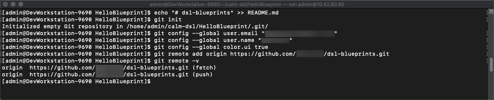

    - ```git status``` to see whats being tracked

    - ```git add --all``` adds all files in the current directory into staging

    - ```git status``` to see the change after adding the files


    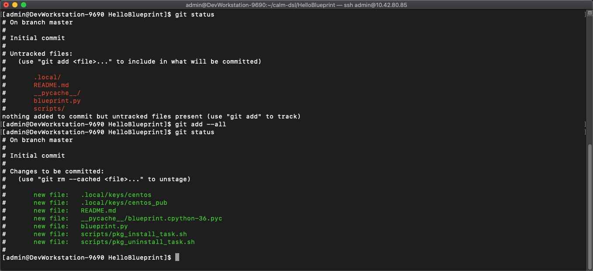

    - From the above output we can see there are some keys so lets remove those since this is being pushed to a public repo

    - ```git rm --cached .local -r```

    - ```git status``` to verify they were removed 


    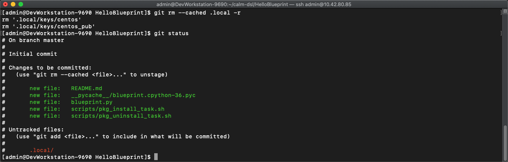

    - ```git commit -m "My DSL blueprints"``` to commit the files


    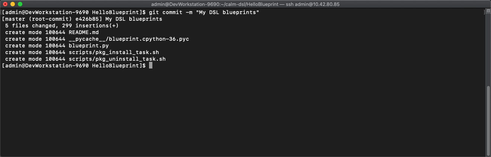

     - ```git push -u origin master``` to push to git.  You will be prompted for your user/pass unless you setup key access to github


    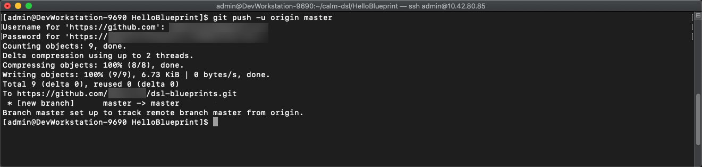

     -  Check your github repo and verify your files were pushed.  Now that your blueprints exists in both Calm and github lets increase the memory to 8 in the blueprint by running:

        - ```sed -i 's/memory = 4/memory = 8/g' blueprint.py``` use the linux sed tool to change the memory config

        - ```git add blueprint.py```

        - ```git commit -m "change memory"```

        - ```git push -u origin master```

    - Back in github there is a new verion under the "history" of blueprint.py with the changed memory

    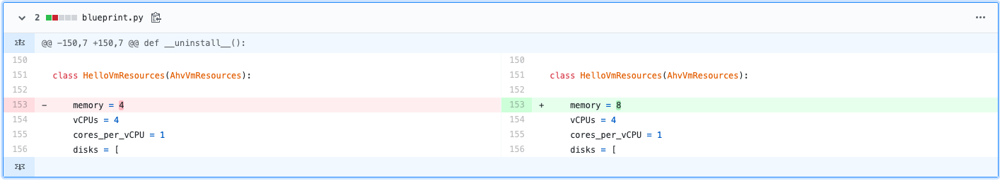

    ## Looking back

    As you went through this module we pushed our original blueprint to Git and we made edits to that blueprint using sed. Then we pushed the blueprint back to Git where we started mainitaing different versions.
