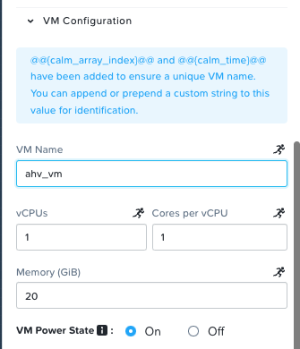

# VM Power actions support in DSL

1. Allows you to provide the Power On, Power Off option in the config for AHV, VMWARE providers
2. Allows you to create post create actions in substrate
3. Allows you to add VM Power ON/ Power Off/ Check Login actions in Custom actions for AHV, VMWARE, AZURE, AWS, GCP at service/profile level
4. Allows you to create VM Power ON/ Power Off/ Check Login actions in Post Create tasks.

## Support to provide the Power On, Power Off option in the config for AHV, VMWARE providers

To enable power state in ahv, vmware config similar to below, you can use power_on, power_off attributes of AhvVmResources class for AHV only or specify in yaml for AHV, VMware. 



```python

class ResourceClass(AhvVmResources):
    memory = 1
    vCPUs = 1
    cores_per_vCPU = 1
    disks = [AhvVmDisk.Disk.Scsi.cloneFromImageService(CENTOS_CI, bootable=True)]
    nics = [AhvVmNic.NormalNic.ingress(SUBNET_NAME, cluster=CLUSTER)]
    power_state = "ON" # specify it here

```

```yaml
resources:
  account_uuid: f87469b4-cc06-4f0e-b51b-99b9b3fa8b41
  power_state: poweron # specify it here
  controller_list: []
  cpu_hot_add: false
  disk_list: []
  memory_hot_plug: false
  memory_size_mib: 3072
  nic_list:
  - net_name: key-vim.host.PortGroup-vlan.112
    nic_type: e1000
    type: ''
  num_sockets: 1
  num_vcpus_per_socket: 1

```

Note:
- Valid power state values for vmware: [ON, OFF, poweron, poweroff]
- Valid power state values for ahv: [ON, OFF]

This is with reference to what fields of power state are supported in CALM Backend.

## Support to create post create actions in substrate

Added `__post_create__` function in Substrate class. This will allow user to create tasks that will be executed post vm creation. To add tasks in post create follow below example:

```python
class VM1(Substrate):
    """AHV VM Substrate"""

    provider_type = "AHV_VM"
    provider_spec = AhvVm1

    @action
    def __post_create__():
        Task.Exec.escript(
            name="Task1", script="print 'Post create task runs after VM is created'"
        )
```

## Support to add VM Power ON/ Power Off/ Check Login actions in Custom actions for AHV, VMWARE, AZURE, AWS, GCP at service/profile level

Supports `__vm_power_on`, `__vm_power_off__`, `__vm_restart__`, `__vm_check_login__` functions in Substrate class to create actions containing runbook for action_poweron, action_poweroff, action_restart, action_check_login these are default system level actions which are called as runbook reference while inserting vm power actions in custom actions at profile/service level. This support is provided for AHV, VMWARE, AZURE, AWS, GCP cloud providers.

Use the following example to create vm power actions at service/profile level:

```python

class VM1(Substrate):

    provider_type = "AHV_VM"
    provider_spec = AhvVm1

    @action
    def __vm_power_on__():
        pass

    @action
    def __vm_power_off__():
        pass

    @action
    def __vm_restart__():
        pass

    @action
    def __vm_check_login__():
        pass


class Profile1(Profile):

    deployments = [Deployment1]

    @action
    def custom_profile_action_1():
        VM1.__vm_power_off__(name="VM1PowerOffTask")
        VM1.__vm_power_on__(name="VM1PowerOnTask")
        VM1.__vm_restart__(name="VM1PowerRestart")
        VM1.__vm_check_login__(name="VM1CheckLogin")
```

- `__vm_power_on__` and other vm power actions should be defined at Substrate class to use it further in profile/service level. 
- If these vm power actions are not defined at Substrate class they can’t be used in other classes to create custom actions.
- Default definition of vm power actions is given above it should not be modified. Any overriding of these methods will raise an - error stating override not allowed.
- Default definition itself takes care of addition of necessary tasks needed for proper functioning.
- Use following rule to create custom action at service/profile level

```python
@action
def <action_name>():
    <Substrate_class_name>.<__power_action_name__>(name="Task Name", target=ref(<Target_class_name>))

# For example:
@action
def action1():
    Substrate1.__power_on__(name="Task1", target=ref(Service1))

```

- action_name is valid name of action that contains task to call vm power actions. This mimics the behaviour of UI side. 
- If target is omitted it will take service that is coupled with substrate by default

- Valid targets are: 
    - Service class name for a substrate at service/profile level actions
    - Deployment class name for a substrate at profile level actions
    - Profile level actions can have both deployment and service target. By default service target will be used.

## Support to create post create actions in substrate

Post create actions of substrate as defined above can also contain vm power actions in them. For example:

```python
class VM1(Substrate):

    provider_type = "AHV_VM"
    provider_spec = AhvVm1

    @action
    def __post_create__():
        VM1.__vm_power_off__(name="PowerOnTask", target=ref(VM1))
```

Note: Target for this should always be the Substrate class containing it.

