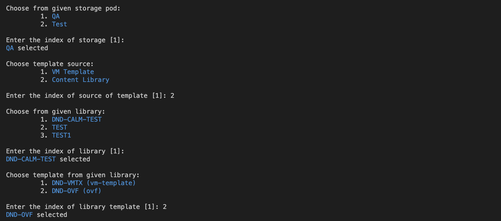

# Calm-DSL supports VPC & Overlay Subnets across entities:

1. Ability to Create, Delete, List VPC Tunnels through network-group-tunnels commands
2. Ability to Whitelist Cluster, VPC and Overlay Subnets in Projects & Environments
3. Ability specify Cluster in VM Spec and Overlay subnets in NICs in Environment
4. Ability to specify Cluster in VM Spec and Overlay subnets in NICs in Blueprints
5. Ability to specify Overlay subnets in NIC for App-Edit
6. Ability to specify Tunnel in IP and HTTP type Endpoints
7. Ability to specify Tunnel in Escript tasks in Runbooks and Blueprints
8. Decompile of Blueprints with Overlay Subnets
9. VPC Cache with Tunnel information
10. Subnets Cache expanded to store Overlay Subnets

## Built-in Models:

- Added `NetworkGroupTunnel` model for creating nework group tunnels. Added `ahv_network_group_tunnel_vm_spec()` for creating network group tunnel vm spec.
    ```
    class NewNetworkGroupTunnel2(NetworkGroupTunnel):
        """Network group tunnel for test"""
        account = Ref.Account("NTNX_LOCAL_AZ")

        platform_vpcs = [Ref.Vpc("test_ng_vpc_61ee30a66f0b", account_name="NTNX_LOCAL_AZ")]

        tunnel_vm_spec = ahv_network_group_tunnel_vm_spec("auto_cluster_prod_4fee9603c584", "ng_tunnel_vpc_subnet_e61ad7fdb778")

    ```
- Added `vpc` parameter in `Ref.Subnet()` helper for specifying vpc of overrlay subnets.
    ```
    Ref.Subnet(name="overlay-subnet-name",vpc="vpc-name")
    ```
- Added `vpc` parameter in `AhvVmNic` to specify overlay subnets
    ```
    AhvVmNic(subnet="overlay-subnet", vpc="vpc-name")
    ```
- Added `cluster` field for `AhvVm` model for specifying cluster for vm configuration.
    ```
    class MyVM(AhvVM):
        cluster = Ref.Cluster(name="cluster-name")
    ```
- Added `Ref.VPC()` for referencing vpcs.
    ```
    Ref.VPC(name=<VPC-name>, account_name=<account-name>)
    ```
- Added `Ref.Tunnel()` helper for referencing tunnels.
    ```
    Ref.Tunnel(name="tunnel-name")
    ```


## VPC Tunnels/Network Group Tunnels

Network Group Tunnels (network-group-tunnels) commands are available to perform Create, Delete and List of VPC Tunnels. VPC Tunnels are refrenced using Tunnel Name. Look [here](../../examples/NetworkGroupTunnel/network_group_tunnel.py) for sample example.

### Commands

- Create network group tunnel: `calm create network_group_tunnel -f tunnel_file.py`
- List of all VPC/Network Group Tunnels: `calm get network-group-tunnels`
- Describes a VPC Tunnel: `calm describe network-group-tunnel <tunnel-name>`
- Deletes a VPC Tunnel: `calm delete network-group-tunnel <tunnel-name>`


### Sample examples

#### Project Example with Cluster, VPC and Overlay Subnet

- User can use specify clusters, VPCs and Overlay Subnets in Projects. Clusters whitelisting can be done for Projects with VLAN subnets also. Look [here](../../tests/project/test_project_with_overlay_subnets.py)
    ```
    class OverlaySubnetProject(Project):
    """Sample DSL Project"""

    providers = [
        Provider.Ntnx(
            account=Ref.Account("account-name"),
            subnets=[Ref.Subnet(name="vlan-name", cluster="cluster-name"),
                    Ref.Subnet(name="overlay-subnet-name",vpc="vpc-name")
            ],
            clusters=[Ref.Cluster(name="cluster-name", account_name="account-name")],
            vpcs=[Ref.Vpc(name="vpc-name", account_name="account-name")]
        ),
    ]
    ```

#### Example for referencing cluster in AhvVm
- Users can specify cluser used for vm configuration.
    ```
    class MyVM(AhvVM):
        cluster = Ref.Cluster(name="cluster-name")
    ```
  
 #### Example for using overlay subnets
 - Can be used in Projects as described above
 - User can specify overlay subnets within AhvVmResources
 - Look [here](../../examples/vpcBlueprint/blueprint.py) for blueprint example using overlay subnets and referrencing cluster.
    ```
    class MyVMResources(AhvVMResources)
        nics = [AhvVmNic(subnet="overlay-subnet", vpc="vpc-name")]
    ```
  - User can specify overlay subnets Ahv App-Edit. Sample
    ```
    nics = [
        PatchField.Ahv.Nics.add(
            AhvVmNic(subnet="overlay-subnet", vpc="vpc-name"),
            editable=True,
        ),
    ]
    ```
 

#### Examples to reference Tunnel in different constructs.
- Can be used in Endpoints of type IP and HTTP. Sample below, Tunnel reference is accepted as an argument in Endpoint helpers.
  ```
    DslHTTPEndpoint = Endpoint.HTTP(
      URL, verify=True, auth=Endpoint.Auth(AUTH_USERNAME, AUTH_PASSWORD),
      tunnel=Ref.Tunnel(name=VPC_TUNNEL)
  ```
- Can be used in Escript based Tasks. Sample below. Tunnel reference is accepted as an argument in Task helpers.
  ```
    Task.SetVariable.escript(name="tunnel_set_var", filename="<file-name>", tunnel=Ref.Tunnel(name="tunnel-name"))
    Task.Exec.escript(name="tunnel_exec", filename="<file-name>", tunnel=Ref.Tunnel(name="tunnel-name"))
  ```


# Calm-DSL support for vCenter Content Library
- This allows using of templates from the content library in blueprints.
OVF and VM-Template types are supported, through which we can deploy VMs using these templates.

## Command changes:
- Updated `calm create provider_spec -t VMWARE_VM` to allow taking input for template selection from content library.

    

